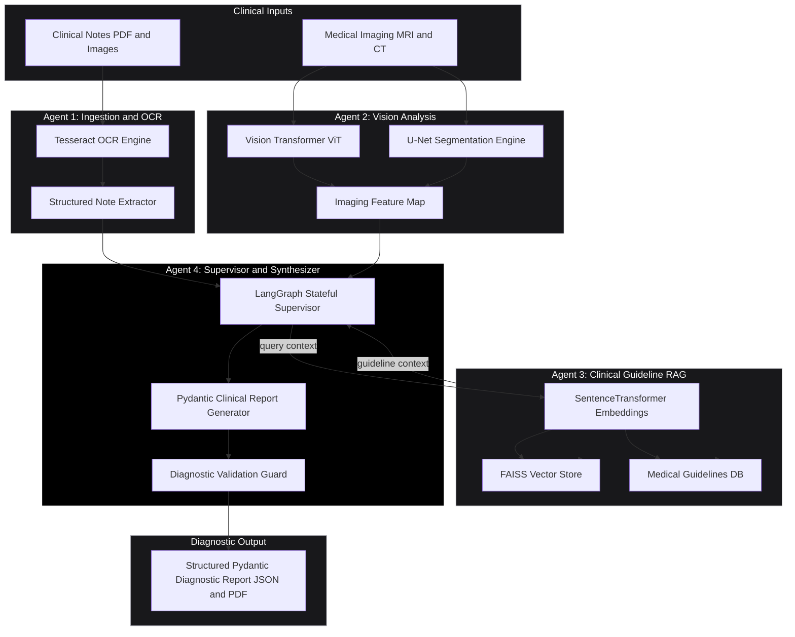
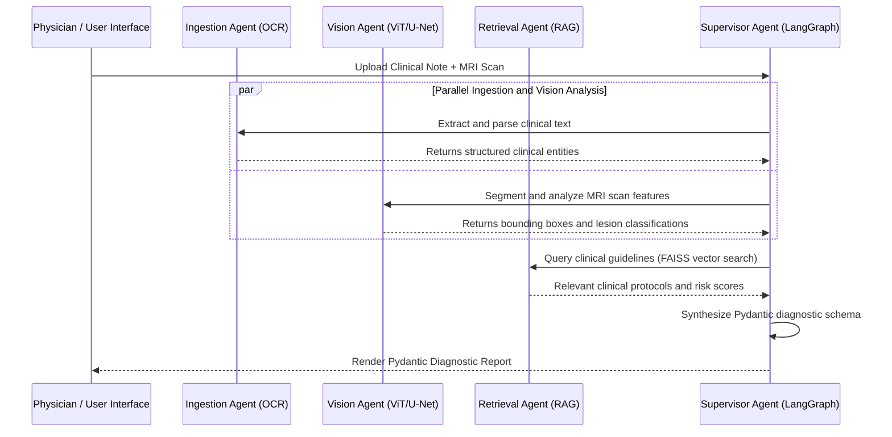

# SynapseMed -- Stateful Multi-Agent Clinical Diagnostic Platform

SynapseMed is a stateful multi-agent medical diagnostic and clinical decision support system. It ingests clinical notes via OCR, processes medical imaging (MRI/CT scans) via Vision Transformer and U-Net pipelines, queries evidence-based medical guidelines through RAG (Retrieval-Augmented Generation), and synthesizes validated Pydantic diagnostic reports.

---

## Architecture Topology



---

## Multi-Agent Workflow Sequence Diagram



---

## Agent System Overview

| Agent | Responsibility | Underlying Technology |
|-------|----------------|----------------------|
| **Ingestion Agent** | OCR text extraction from clinical notes, vitals parsing, lab results formatting | Tesseract OCR, PyPDF2, Regex NLP |
| **Vision Agent** | MRI/CT scan feature extraction, tumor/lesion segmentation, heatmap visualization | PyTorch, Vision Transformer (ViT), U-Net |
| **Retrieval Agent** | Semantic search over clinical practice guidelines & drug interaction databases | LangChain, FAISS Vector DB, HuggingFace Embeddings |
| **Supervisor Agent** | Multi-agent coordination, state management, Pydantic report synthesis | LangGraph, Pydantic v2, FastAPI |

---

## Directory Structure

```
SynapseMed/
|-- docker-compose.yml          # Multi-container orchestration (Backend + Frontend + Vector DB)
|-- README.md                   # ASCII Architecture & User Documentation
|-- backend/
|   |-- Dockerfile              # PyTorch + Tesseract OCR FastAPI container
|   |-- requirements.txt        # FastAPI, LangGraph, PyTorch, FAISS dependencies
|   |-- uploads/                # Temporary file upload storage
|   |-- vector_db/              # FAISS vector database indices
|   `-- app/
|       |-- __init__.py
|       |-- main.py             # FastAPI entry point & WebSocket endpoints
|       |-- config.py           # Environment variables & model thresholds
|       |-- schemas.py          # Pydantic v2 diagnostic schemas
|       |-- agents/
|       |   |-- __init__.py
|       |   |-- ingestion.py    # OCR & note parsing agent
|       |   |-- vision.py       # ViT & U-Net MRI scan agent
|       |   |-- retrieval.py    # RAG guideline search agent
|       |   `-- supervisor.py   # LangGraph multi-agent coordinator
|       `-- utils/              # Helper functions & image preprocessors
`-- frontend/                   # Web User Interface
```

---

## Quick Start Guide

### Prerequisites
- Docker & Docker Compose **OR** Python 3.10+ with PyTorch and Tesseract OCR installed.

### Running with Docker Compose

1. **Clone Repository**:
   ```bash
   git clone https://github.com/siddarth1872004/SynapseMed.git
   cd SynapseMed
   ```

2. **Launch Services**:
   ```bash
   docker-compose up --build
   ```

3. **Access Application**:
   - Backend API Docs: `http://localhost:8000/docs`
   - Frontend Dashboard: `http://localhost:3000`

### Local Development Setup

1. **Navigate to Backend**:
   ```bash
   cd backend
   pip install -r requirements.txt
   ```

2. **Start FastAPI Application**:
   ```bash
   uvicorn app.main:app --reload --port 8000
   ```

---

## License

Distributed under the **MIT License**. See `LICENSE` for details.
